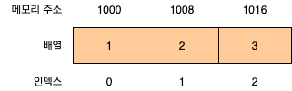
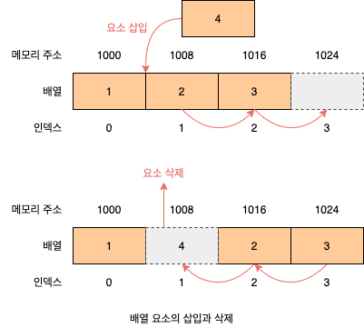

# 27. 배열

## 27.1 배열이란?

**배열**(Array)은 여러 개의 값을 순차적으로 나열한 자료구조입니다. 베열이 가지고 있는 값을 **요소**(Element)라고 부릅니다. 자바스크립트에서 모든 값은 배열의 요소가 될 수 있습니다. 즉, 원시값은 물론 객체, 함수, 배열 등 자바스크립트에서 값으로 인정하는 모든 것은 배열의 요소가 될 수 있습니다. 배열의 요소는 배열에서 자신의 위치를 나타내는 0 이상의 정수 **인덱스**(Index)를 갖습니다. 인덱스는 배열의 요소에 접근할 때 사용합니다. 대부분의 프로그래밍 언어에서 인덱스는 0부터 시작합니다.

요소에 접근할 때는 대괄호 표기법을 사용합니다. 대괄호 내에는 접근하고 싶은 요소의 인덱스를 지정합니다.

```javascript
const arr = ["apple", "banana", "orange"];

console.log(arr[0]); // apple
console.log(arr[1]); // banana
console.log(arr[2]); // orange
```

배열은 요소의 개수, 즉 배열의 길이를 나타내는 `length` 프로퍼티를 갖습니다.

```javascript
console.log(arr.length); // 3
```

배열은 인덱스와 `length` 프로퍼티를 갖기 때문에 `for` 문을 통해 순차적으로 요소에 접근할 수 있습니다.

```javascript
for (let i = 0; i < arr.length; i += 1) {
  console.log(arr[i]);
}
```

자바스크립트에 배열이라는 타입은 존재하지 않습니다. 배열은 객체 타입입니다.

```javascript
console.log(typeof arr); // object
```

배열은 배열 리터럴, `Array` 생성자 함수, `Array.of`, `Array.from` 메서드로 생성할 수 있습니다. 배열의 생성자 함수는 `Array`이며, 배열의 프로토타입 객체는 `Array.prototype`입니다. `Array.prototype`은 배열을 위한 빌트인 메서드를 제공합니다.

```javascript
const arr = [1, 2, 3];

console.log(arr.constructor === Array); // true
console.log(Object.getPrototypeOf(arr) === Array.prototype); // true
```

배열은 객체지만 일반 객체와는 구별되는 독특한 특징이 있습니다.

| 구분            |           객체            |     배열      |
| --------------- | :-----------------------: | :-----------: |
| 구조            | 프로퍼티 키와 프러퍼티 값 | 인덱스와 요소 |
| 값의 참조       |        프로퍼티 키        |    인덱스     |
| 값의 순서       |             X             |       O       |
| length 프로퍼티 |             X             |       O       |

배열의 장점은 처음부터 순차적으로 요소에 접근할 수도 있고, 마지막부터 역순으로 요소에 접근할 수도 있으며, 특정 위치부터 순차적으로 요소에 접금할 수도 있다는 것입니다. 이는 배열이 인덱스, 즉 값의 순서와 `length` 프로퍼티를 갖기 때문에 가능한 것입니다.

## 27.2 자바스크립트 배열은 배열이 아니다

**자료구조**(Data Structure)에서 말하는 배열은 동일한 크기의 메머리 공간이 빈틈없이 연속적으로 나열된 자료구조를 말합니다. 즉, 배열의 요소는 하나의 데이터 타입으로 통일되어 있으며 서로 연속적으로 인접해 있습니다. 이러한 배열을 **밀집 배열**(Dense Array)이라 합니다. 일반적인 의미의 배열은 임의의 요소에 접근(**임의 접근**(Random Access), 시간 복잡도 O(1))할 수 있습니다. 이는 매우 효율적이며, 고속으로 동작합니다.

```
검색 대상 요소의 메모리 주소 = 배열의 시작 메모리 주소 + 인덱스 * 요소의 바이트 수
```



하지만 정렬되지 않은 배열에서 특정한 요소를 검색하는 경우 배열의 모든 요소를 처음부터 특정 요소를 발견할 때까지 차례대로 검색(**선형 검색**(Line Search), 시간 복잡도 O(n))해야 합니다. 또한 배열에 요소를 삽입하거나 삭제하는 경우 배열의 요소를 연속적으로 유지하기 위해 요소를 이동시켜야 하는 단점도 있습니다.



자바스크립트의 배열은 일반적인 의미의 배열과 다릅니다. 즉, 배열의 요소를 위한 각각의 메모리 공간은 동일한 크기를 갖지 않아도 되며, 연속적으로 이어져 있지 않을 수도 있습니다. 배열의 요소가 연속적으로 이어져 있지 않는 배열을 **희소 배열**(Sparse Array)이라 합니다. 자바스크립트의 배열은 일반적인 배열의 동작을 흉내 낸 특수한 객체입니다.

```javascript
console.log(Object.getOwnPropertyDescriptors([1, 2, 3]));
/*
{
  '0': {value: 1, writable: true, enumerable: true, configurable: true},
  '1': {value: 2, writable: true, enumerable: true, configurable: true},
  '2': {value: 3, writable: true, enumerable: true, configurable: true},
  length: {value: 3, writable: true, enumerable: false, configurable: false}
}
*/
```

자바스크립트 배열은 인덱스를 나타내는 문자열을 프로퍼티 키로 가지며, `length` 프로퍼티를 갖는 특수한 객체입니다. 자바스크립트 배열의 요소는 사실 프로퍼티 값입니다. 자바스크립트에서 사용할 수 잇는 모든 값은 객체의 프로퍼티 값이 될 수 있으므로 어떤 값이라도 배열의 요소가 될 수 있습니다.

```javascript
const arr = [
  "string",
  10,
  true,
  null,
  undefined,
  NaN,
  Infinity,
  [],
  {},
  function () {},
];
```

자바스크립트 배열은 해시 테이블로 구현된 객체이므로 인덱스로 요소에 접근하는 경우 일반적인 배열보다 성능적인 면에서 느릴 수밖에 없는 구조적인 단점이 있습니다. 하지만 특정 요소를 검색하거나 요소를 삽입 또는 삭제하는 경우에는 일반적인 배열보다 빠른 성능을 기대할 수 있습니다. 인덱스로 배열 요소에 접근할 때 일반적인 배열보다 느릴 수밖에 없는 구조적인 단점을 보완하기 위해 대부분의 모던 자바스크립트 엔진은 배열을 일반 객체와 구별하여 좀 더 배열처럼 동작하도록 최적화하여 구현했습니다. 다음과 같이 배열과 일반 객체의 성능을 테스트해 보면 배열이 일반 객체보다 약 2배 정도 빠르다는 것을 알 수 있습니다.

```javascript
const arr = [];

console.time("Array Performance Test");

for (let i = 0; i < 10000000; i += 1) {
  arr[i] = i;
}
console.timeEnd("Array Performance Test"); // 약 340ms

const obj = {};

console.time("Object Preformace Test");

for (let i = 0; i < 10000000; i += 1) {
  obj[i] = i;
}

console.timeEnd("Object Preformace Test"); // 약 600ms
```

## 27.3 length 프로퍼티와 최소 배열

`length` 프로퍼티는 요소의 개수, 즉 배열의 길이를 나타내는 0 이상의 정수를 값으로 갖습니다. `length` 프로퍼티의 값은 빈 배열일 경우 0이며, 빈 배열이 아닌 경우 가장 큰 인덱스에 1을 더한 것과 같습니다. `length` 프로퍼티의 값은 0과 2^32^ - 1(4,294,967,296 - 1) 미만의 양의 정수입니다. 즉, 배열은 요소를 최대 2^32^ - 1(4,294,967,296 - 1)개 가질 수 있습니다. `length` 프로퍼티의 값은 배열에 요소를 추가하거나 삭제하면 자동 갱신됩니다.

```javascript
const arr = [1, 2, 3];
console.log(arr.length); // 3

// 요소 추가
arr.push(4);
console.log(arr.length); // 4

// 요소 삭제
arr.pop();
console.log(arr.length); // 3
```

`length` 프로퍼티 값은 요소의 개수, 즉 배열의 길이를 바탕으로 결정되지만 임의의 숫자 값을 명시적으로 할당할 수도 있습니다. 현재 `length` 프로퍼티 값보다 작은 숫자 값을 할당하면 배열의 길이가 줄어듭니다. 주의할 것은 현재 `length` 프로퍼티 값보다 큰 숫자 값을 할당하는 경우입니다. 이때 `length` 프로퍼티에 값은 성공적으로 변경되지만 실제 배열에는 아무런 변함이 없습니다. 값 없이 비어 있는 요소를 위해 메모리 공간을 확보하지 않으며 빈 요소를 생성하지도 않습니다.

```javascript
const arr = [1, 2, 3, 4, 5];

arr.length = 1;
console.log(arr); // [1]

arr.length = 3;
console.log(arr.length); // 3
console.log(arr); // [1, empty * 2]
console.log(Object.getOwnPropertyDescriptors(arr));
/*
{
  '0': {value: 1, writable: true, enumerable: true, configurable: true},
  length: {value: 3, writable: true, enumerable: false, configurable: false}
}
*/
```

이처럼 배열의 요소가 연속적으로 위치하지 않고 일부가 비어 있는 배열을 희소 배열이라 합니다. 자바스크립트는 희소 배열을 문법적으로 허용합니다. 희소 배열은 `length`와 배열 요소의 개수가 일치하지 않습니다.

```javascript
const sparse = [, 2, , 4];

console.log(sparse.length); // 4
console.log(aprse); // [empty, 2, empty, 4]
console.log(Object.getPropertyDescriptors(sparse));
/*
{
  '1': {value: 2, writable: true, enumerable: true, configurable: true},
  '3': {value: 4, writable: true, enumerable: true, configurable: true},
  length: {value: 4, writable: true, enumerable: false, configurable: false}
}
*/
```

자바스크립트는 문법적으로 희소 배열을 허용하지만 희소 배열은 사용하지 않는 것이 좋습니다. 의도적으로 희소배열을 만들어야 하는 상황은 발생하지 않습니다. 희소 배열은 연속적인 값의 집합이라는 배열의 기본적인 개념과 맞지 않으며, 성능에도 좋지 않은 영향을 줍니다. 최적화가 잘 되어 있는 모던 자바스크립트 엔진은 요소의 타입이 일치하는 배열을 생성할 때 일반적인 의미의 배열처럼 연속된 메모리 공간을 확보하는 것으로 알려져 있습니다.

## 27.4 배열 생성

### 27.4.1 배열 리터럴

배열 리터럴은 0개 이상의 요소를 쉼표로 구분하여 대괄호(`[]`)로 묶습니다. 배열 리터럴은 객체 리터럴과 달리 프로퍼티 키가 없고 값만 존재합니다.

```javascript
const arr = [1, 2, 3];
console.log(arr.length); // 3
```

### 27.4.2 Array 생성자 함수

`Object` 생성자 함수를 통해 객체를 생성할 수 있듯이 `Array` 생성자 함수를 통해 배열을 생성할 수도 있습니다.

###### 전달된 인수가 없는 경우 빈 배열을 생성합니다. 리터럴 []과 같습니다.

```javascript
new Array(); // []
```

###### 전달된 인수가 1개이고 숫자인 경우 length 프로퍼티 값이 인수인 배열을 생성합니다.

이떄 생성된 배열은 희소 배열입니다. length 값은 0이 아니지만 실제로 배열의 요소는 존재하지 않습니다. 배열은 요소를 최대 2^32^ - 1개 가질 수 있습니다. 전달된 인수가 범위를 벗어나면 RangeError가 발생합니다.

```javascript
const arr = new Array(10);

console.log(arr); // [empty * 10]
console.log(arr.length); // 10
console.log(Object.getPropertyDescriptors(arr));
/*
{
  length: {value: 10, writable: true, enumerable: false, configurable: false}
}
*/
```

###### 전달된 인수가 2개 이상이거나 숫자가 아닌 경우 인수를 요소로 갖는 배열을 생성합니다.

```javascript
const numArr = new Array(1, 2, 3);
console.log(numArr); // [1, 2, 3]

const objArr = new Array({});
console.log(objArr); // [{}]
```

###### 일반 함수로서 호출해도 배열을 생성하는 생성자 함수로 동작합니다.

이는 `Array` 생성자 함수 내부에서 `new.target`을 확인하기 때문입니다.

```javascript
const arr = Array(1, 2, 3);
```

### 27.4.3 Array.of

ES6에서 도입된 `Array.of` 메서드는 전달된 인수를 요소로 갖는 배열을 생성합니다. `Array.of`는 `Array` 생성자 함수와 다르게 전달된 인수가 1개이고 숫자이더라도 인수를 요소로 갖는 배열을 생성합니다.

```javascript
Array.of(1); // [1]
Array.of(1, 2, 3); // [1, 2, 3]
Array.of("string"); // ['string']
```

### 27.4.4 Array.from

ES6에서 도입된 Array.from 메서드는 **유사 배열 객체**(Array-Like Object) 또는 **이터러블 객체**(Iterable Object)를 인수로 전달받아 배열로 변환하여 반환합니다.

```javascript
Array.from({ length: 2, 0: "a", 1: "b" }); // ['a', 'b']
Array.from("Hello"); // ['H', 'e', 'l', 'l', 'o']
```

`Array.from`을 사용하면 두 번째 인수로 전달한 콜백 함수를 통해 값을 만들면서 요소를 채울 수 있습니다. `Array.from` 메서드는 두 번째 인수로 전달한 콜백 함수에 첫 번째 인수에 의해 생성된 배열의 요소값과 인덱스를 순차적으로 전달하면서 호출하고, 콜백 함수의 반환값으로 구성된 배열을 반환합니다.

```javascript
Array.from({ length: 3 }, (_, i) => i); // [0, 1, 2]
```

## 27.5 배열 요소의 참조

배열의 요소를 참조할 때에는 대괄호(`[]`) 표기법을 사용합니다. 대괄호 안에는 인덱스가 와야 합니다. 정수로 평가되는 표현식이라면 인덱스 대신 사용할 수 있습니다. 인덱스는 값을 참조할 수 있다는 의미에서 객체의 프로퍼티 키와 같은 역할을 합니다. 따라서 존재하지 않는 프로퍼티 키로 객체의 프로퍼티에 접근했을 때 `undefined`를 반환하는 것처럼 배열도 존재하지 않는 요소를 참조하면 `undefined`를 반환합니다.

```javascript
const arr = [1, 2];

console.log(arr[0]); // 1
console.log(arr[1]); // 2
console.log(arr[2]); // undefined
```

## 27.6 배열 요소의 추가와 갱신

객체에 프로퍼티를 동적으로 추가할 수 있는 것처럼 배열에도 요소를 동적으로 추가할 수 있습니다. 존재하지 않는 인덱스를 사용해 값을 할당하면 새로운 요소가 추가됩니다. 이때 `length` 프로퍼티 값은 자동 갱신됩니다. 만약 현재 배열의 `length` 프로퍼티 값보다 큰 인덱스로 새로운 요소를 추가하면 희소 배열이 됩니다. 이때 인덱스로 요소에 접근하여 명시적으로 값을 할당하지 않은 요소는 생성되지 않는다는 것에 주의합니다.

```javascript
const arr = [0];

arr[1] = 1;
console.log(arr); // [0, 1]
console.log(arr.length); // 2

arr[100] = 100;
console.log(arr); // [0, 1, empty * 98, 100]
console.log(arr.length); // 101
```

이미 요소가 존재하는 요소에 값을 재할당하면 요소값이 갱신됩니다.

```javascript
arr[1] = 10;
console.log(arr); // [0, 10, empty * 98, 100]
```

인덱스는 요소의 위치를 나타내므로 반드시 0 이상의 정수(또는 정수 형태의 문자열)를 사용해야 합니다. 만약 정수 이외의 값을 인덱스처럼 사용하면 요소가 생성되는 것이 아니라 프로퍼티가 생성됩니다. 이때 추가된 프로퍼티는 `length` 프로퍼티 값에 영향을 주지 않습니다.

```javascript
const arr = [];

arr[0] = 1;
arr["1"] = 2;
arr["foo"] = 3;
arr.bar = 4;
arr[1.1] = 5;
arr[-1] = 6;

console.log(arr); // [1, 2, foo: 3, bar: 4, '1.1': 5, '-1': 6]
console.log(arr.length); // 2
```

## 27.7 배열 요소의 삭제

배열은 사실 객체이기 때문에 배열의 특정 요소를 삭제하기 위해 `delete` 연산자를 사용할 수 있습니다. 이때 배열은 희소 배열이 되며 `length` 프로퍼티 값은 변하지 않습니다. 따라서 희소 배열을 만드는 `delete` 연산자는 사용하지 않는 것이 좋습니다.

```javascript
const arr = [1, 2, 3];

delete arr[1];
console.log(arr); // [1, empty, 3]
```
