# 1. 서론

**운영체제**는 컴퓨터 하드웨어를 관리하는 소프트웨어입니다. 운영체제는 또한 응용 프로그램을 위한 기반을 제공하며 컴퓨터 사용자와 컴퓨터 하드웨어 사이에서 중재자 역할을 수행합니다.

## 1.1 운영체제가 할 일

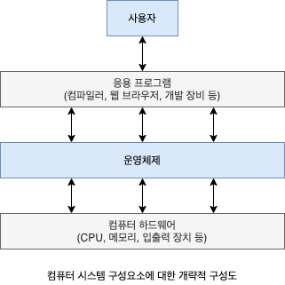

컴퓨터 시스템은 대개 네 가지 구성요소인 하드웨어, 운영체제, 응용 프로그램 및 사용자로 구분할 수 있습니다.

- **하드웨어:** 중앙 처리 장치(CPU), 메모리 및 입출력(I/O) 장치로 구성되어 기본 계산용 자원을 제공
- **응용 프로그램:** 사용자의 계산 문제를 해결하기 위해 이들 자원이 어떻게 사용될지를 정의합니다.
- **운영체제:** 사용자를 위해 다양한 응용 프로그램 간의 하드웨어 사용을 제어하고 조정합니다.

또한 우리는 컴퓨터 시스템이 하드웨어, 소프트웨어 및 데이터로 구성되어 있다고 볼 수 있습니다. 운영 체제는 컴퓨터 시스템이 동작할 때 이들 자원을 적절하게 사용할 수 있는 방법을 제공합니다.

### 1.1.1 사용자 관점

컴퓨터에 대한 사용자의 관점은 사용되는 인터페이스에 따라 달라집니다. 많은 컴퓨터 사용자는 랩톱 혹은 모니터, 키보드, 마우스로 구성된 PC 앞에서 작업합니다. 이러한 시스템은 한 사용자가 자원을 독점하도록 설계되었으며 목표는 사용자가 수행하는 작업을 최대화하는 것입니다. 이러한 경우 운영체제는 대부분 **사용의 용이성**을 위해 설계되고 성능에 약간 신경을 쓰고 다양한 하드웨어와 소프트웨어 자원이 어떻게 공유되느냐의 **자원의 이용**에는 전혀 신경을 쓰지 않습니다.

일부 컴퓨터는 사용자 관점이 존재하지 않거나 매우 작은 예도 있습니다. 예를 들면, 가전제품이나 자동차 내의 **내장형 컴퓨터**는 숫자 키패드를 가지고, 상태를 보이기 위해 표시등을 켜고 끌 수 있지만 이들 컴퓨터나 운영체제와 응용 프로그램은 사용자의 개입 없이 작동하도록 설계되어 있습니다.

### 1.1.2 시스템 관점

컴퓨터 시스템은 문제를 해결하기 위해 요구되는 여러 가지 자원들을 가집니다. 운영체제는 컴퓨터 시스템을 효율적이고 공정하게 운영할 수 있도록 어느 요청에 자원을 홯당할지 결정하는 **자원 할당자**(Resource Allocator)로서 동작합니다. 또한 컴퓨터의 부적절한 사용을 방지하기 위해 입출력 장치와 사용자 프로그램을 제어하는 **제어 프로그램**입니다.

### 1.1.3 운영체제의 정의

일반적으로 운영체제에 대한 적합한 정의는 없습니다. 운영체제는 유용한 컴퓨팅 시스템을 만들기 위한 합리적인 방법을 제공하기 때문에 존재합니다. 프로그램에 필요한 자원을 제어하고 할당하는 일반적인 기능들이 운영체제라는 하나의 소프트웨어로 통합됩니다.

운영체제에 포함되는 요소에 보편적인 정의는 없습니다. 포함되는 기능은 시스템마다 크게 다릅니다. 일반적으로 필요한 운영체제를 컴퓨터에서 실행하는 프로그램인 **커널**과 함께 두 가지 다른 유형의 프로그램이 포함됩니다. 운영체제와 관련되어 있지만 반드시 커널의 일부일 필요는 없는 **시스템 프로그램**과 시스템 작동과 관련되지 않은 모든 프로그램을 포함하는 **응용 프로그램**입니다.

개인용 컴퓨터가 널리 보급되고 운영체제가 점점 정교해짐에 따라 운영체제의 구성 용소가 무엇인지 점점 중요해 졌습니다. 1998년 Microsoft는 너무 많은 기능을 포함하여 응용 프로그램 공급 업체의 경쟁을 막았다고 유죄를 선고받았습니다. (에를 들어, 웹 브라우저는 Microsoft 운영체제의 필수 요소입니다.) 그러나 오늘날 모바일 기기의 운영체제를 살펴보면 운영체제를 구성하는 기능의 수가 다시 증가하고 있습니다. 모바일 운영체제에는 종종 핵심 커널뿐만 아니라 **미들웨어**(응용 프로그램 개발자에게 추가 서비스를 제공하는 일련의 소프트웨어 프레임 워크)도 포함됩니다.

## 1.2 컴퓨터 시스템의 구성

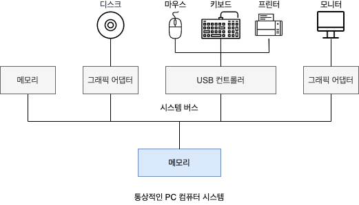

현대의 범용 컴퓨터 시스템은 하나 이상의 CPU와 구성요소와 공유 메모리 사이의 객세스를 제공하는 공통 **버스**를 통해 연결된 여러 장치 컨트롤러로 구성됩니다. 각 장치 컨트롤러는 특정 유형의 장치를 담당하고, 컨트롤러에 따라 둘 이상의 장치가 연결될 수도 있습니다. 장치 컨트롤러는 일부 로컬 버퍼 저장소와 특수 목적 레지스터 집합을 유지 관리하는데, 장치 컨트롤러는 버퍼 저장소와 제어하는 장치 간에 데이터를 이동합니다.

일반적으로 운영체제에는 각 장치 컨트롤러마다 **장치 드라이버**가 있습니다. 이 장치 드라이버는 장치 컨트롤러의 작동을 알고 있고 나머지 운영체제의 장치에 대한 인터페이스를 제공합니다. CPU와 장치 컨트롤러는 병렬로 실행되며, 메모리 사이클을 놓고 경쟁합니다. 공유 메모리를 질서 있게 액세스하기 위해 메모리 컨트롤러는 메모리에 대한 액세스를 동기화합니다.

### 1.2.1 인터럽트(Interrupts)

일반적인 컴퓨터 작업(입출력을 수행하는 프로그램)을 생각해봅니다.

1. 입출력 작업을 시작하기 위해 장치 드러이버는 장치 컨트롤러의 적절한 레지스터에 값을 적재해야 합니다.
2. 장치 컨트롤러는 이러한 레지스터의 내용을 검사하여 수행할 작업을(키보드에서 문자 읽기) 결정합니다.
3. 컨트롤러는 장치에서 로컬 버퍼로 데이터 전송을 시작합니다. 데이터 전송이 완료되면 장치 컨트롤러는 장치 드라이버에게 작업이 완료되었음을 알립니다.
4. 읽기 요청이면 장치 드라이버는 데이터 또는 데이터에 대한 포인터를 반환하며 운영체제의 다른 부분에 제어를 넘깁니다.
5. 다른 작업의 경우 장치 드라이버는 "쓰기 완료" 또는 "장치 사용 중"과 같은 상태 정보를 반환합니다.

컨트롤러는 장치 드라이버에게 작업을 완료했다는 사실을 어떻게 알릴까요? 이는 **인터럽트**를 통해 이루어집니다.

#### 1.2.1.1 개요

각 컴퓨터 설계는 자신의 인터럽트를 메커니즘으로 가지고 있으며, 몇 가지 기능은 공통적입니다.

- 인터럽트는 적절한 서비스 루티으로 제어를 전달합니다.
- 임터럽트 루틴은 반드시 명시적으로 현재의 상태를 저장해야 하며, 복귀하기 전에 그 상태를 복원해야 합니다.

#### 1.2.1.2 구현

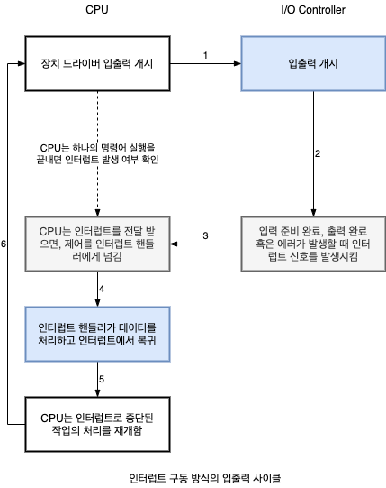

장치 컨트롤러가 인터럽트 요청 라인에 신호를 선언하여 인터럽트를 **발생**(raise) 시키고, CPU는 인터럽트를 **포착**(catch)하여 인터럽트 핸들러로 **디스패치**(dispatch)하고 핸들러는 장치를 서비스하여 인터럽트를 **지웁니다**(clear). 기본 인터럽트 기법은 장치 컨트롤러가 서비스할 준비가 될 때와 같은 비동기 이벤트에 CPU가 대응할 수 있게 합니다. 그러나 최신 운영체제에서는 더욱 정겨한 인터럽트 처리 기능이 필요합니다. 최신 컴퓨터 하드웨어에서 다음 세 가지 기능을 CPU 및 **인터럽트 컨트롤러 하드웨어**에서 제공헙니다.

1. 중요한 처리 중에 인터럽트 처리를 연기할 수 있어야 합니다.
2. 장치의 적절한 인터럽트 핸들러로 효율적으로 디스패치 할 방법이 필요합니다.
3. 운영체제가 우선순위가 높은 인터럽트와 우선순위가 낮은 인터럽트를 구분하고 적절히 대응할 수 있도록 다단계 인터럽트가 필요합니다.

대배분의 CPU에는 2개의 인터럽트 요청 라인이 있습니다. 하나는 복구할 수 없는 메모리 오류와 같은 이벤트를 위해 예약된 **마스크 불가능 인터럽트**(Nonmaskable Interrupt)입니다. 두번째는 장치 컨트롤라가 서비스를 요청하기 위해 사용하는 **마스크 가능 인터럽트**(Maskable)입니다. 마스크 가능 인터럽트는 인터럽트 되어서는 안되는 중요한 명령 시퀀스를 실행하기 전에 CPU에 의해 꺼질 수 있습니다.

**백터 방식 인터럽트 기법**의 목적은 하나의 인터럽트 핸들러가 가능한 모든 인터럽트 소스를 검색할 필요를 줄이기 위함입니다. 그러나 실제로 컴퓨터에는 인터럽트 백터의 주소 개수보다 더 많은 장치(따라서 인터럽트 핸들러)가 있습니다. 이 문제를 해결하는 일반적인 방법은 **인터럽트 체인**을 사용하는 것입니다. 인터럽트 백터의 각 원소는 인터럽트 핸들러 리스트의 헤드를 가리킵니다. 인터럽트가 발생하면 요청을 처리할 수 있는 핸들러가 발견될 때까지 상응하는 리스트의 핸들러가 하나씩 호출됩니다. 이러한 구조느 ㄴ큰 크기의 인터럽트 테이블 오버헤드와 하나의 인터럽트 핸들러로 디스패치 하는 비효율성의 절충안입니다.

인터럽트 기법은 또한 인터럽트 **우선순위 레벨**(Interrupt Priority Level)을 구현합니다. 이러한 레벨을 통해 CPU는 모든 인터럽트를 마스킹하지 않고도 우선순위가 낮은 인터럽트 처리를 연기할 수 있습니다.

### 1.2.2 저장장치 구조

CPU는 메모리에서만 명령을 적재할 수 있으므로 실행하려면 프로그램을 먼저 메모리에 적재해야 합니다. 범용 컴퓨터는 프로그램 대부분을 **메인 메모리**(Random Aceess Memory, RAM)라 불리는 재기로 까능한 메모리에서 가져옵니다. 컴퓨터는 다른 형태의 메모리도 사용합니다. 컴퓨터 전원을 켤 때 가장 먼저 실행되는 프로그램은 **부트스트랩 프로그램**이며 운영체제를 적재합니다. RAM은 **휘발성**이므로 브투스트랩 프로그램을 유지하는 용도로 사용할 수 없고, **EEPROM** 및 기타 형태의 **펌웨어**를 사용합니다. 이 메모리는 변경할 수는 있지만 자주 변경할 수는 없고, 속도가 느려서 정적 프로그램과 데이터를 포함합니다.

모든 형태의 메모리는 바이트 배열을 제공합니다. 각 바이트는 자신의 주소를 가지고 있습니다. 상호 작용은 특정 메모리 주소들에 대한 명령을 통해 이루어집니다.

- **적재 명령:** 메인 메모리로부터 CPU 내부의 레지스터로 한 바이트 또는 한 워드를 옮깁니다.
- **저장 명령:** 반대로 레지스터의 내용을 메인 메모리로 옮깁니다.

> **워드**는 그 컴퓨터 구조의 본연의 데이터 단위입니다. 한 워드는 하나 이상의 바이트로 구성됩니다. 예를 들면 64비트 레지트더들과 64비트 메모리 주소지정을 가지는 컴퓨터는 전형적으로 64비트 워드를 가집니다. 컴퓨터는 많은 연산을 한 번에 한 바이트 단위가 아니라 본연의 워드 단위로 실행합니다.

**폰 노이만 구조 시스템**에서 실행되는 전형적인 명령-실행 사이클은 다음과 같다.

1. 메모리로부터 명령을 인출해, 그 명령을 **명령 레지스터**에 저장합니다.
2. 명령을 해독하고 메모리로부터 피연산자를 인출하여 내부 레지스터에 저장합니다.
3. 피연산자에 대한 명령을 실행한 후에 결과가 메모리에 다시 저장됩니다.

이상적으로는, 프로그램과 데이터가 메인 메모리에 영구희 존재하기를 웒합니다. 그러나 이는 대부분의 시스템에서 두 가지 이유로 불가능합니다.

1. 메인 메모리는 모든 필요한 프로그램과 데이터를 영구히 저장하기에는 너무 작습니다.
2. 메인 메모리는 이미 언급한 것처럼 전원이 공급되지 않으면 그 내용을 잃어버리는 휘발성 저장장치입니다.

그러므로 대부분의 컴퓨터 시스템은 메인 메모리의 확장으로 **보조저장장치**를 제공합니다. 보조저장장치의 주요 요건은 대량의 데이터를 영구히 보존할 수 있어야 한다는 점입니다. 가장 일반적인 보조저장장치는 **하드 디스크 드라이브**(HDD)와 **비휘발성 메모리 장치**(NVM)로, 프로그램과 데이터 모두를 위한 저장소를 제공합니다. 대부분의 프로그램(시스템 및 응용 프로그램)은 메모리에 적재될 때까지 보조저장장치에 저장됩니다. 캐시 메모리, CD-ROM 또는 Blu-ray, 자기 테이프등 자료의 백업 사본을 저장과 같은 특수 목적으로만 사용하기에, 매우 느리고 용량이 큰 저장장치를 **3차 저장장치**라고 합니다. 다양한 저장장치의 차이점은 속도, 크기 및 휘발성에 있습니다.

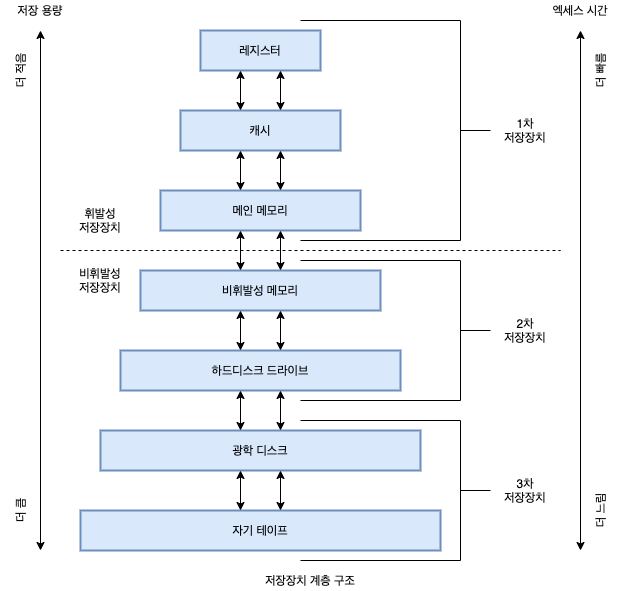

그림에서 최상위 4단계 메모리는 반도체 기반 전자회로로 구성된 **반도체 메모리**를 사용하여 구성됩니다. 네 번째 수준의 NVM 장치의 가장 일반적인 형태는 스마트폰 및 태블릿과 같은 모바일 장치에서 널리 사용되는 플래시 메모리입니다.

저장장치는 운영체제 구조에서 중요한 역할을 하기 때문에 교재에서 자주 참조할 것이기에 다음 용어를 사용할 것입니다.

- **메모리:** 휘발성 저장장치입니다.
- **NVS:** 전원이 꺼졌을 때 내용을 유지하는 비휘발성 보조저장장치입니다.
  - **기계적**(HDD, 광 디스크, 홀로그램) 저장장치는 일반적으로 전기적 저장장치보다 용량이 크고 바이트당 비용이 저렴합니다.
  - **전기적** 저장장치(플래시 메모리, FRAM, NRAM 및 SSD)는 일반적으로 기계적 저장장치보다 비싸고 용량이 적으며 빠릅니다. **NVM**으로 언급됩니다.

### 1.2.3 입출력 구조

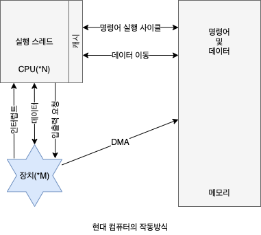

1.2.1절에 설명된 인터럽트 구동 I/O의 형태는 소량의 데이터를 이동하는 데는 좋지만 NVS I/O와 같은 대량의 데이터 이동에 사용될 때 높은 오버헤드를 유발할 수 있습니다. 이 문제를 해결하기 위해 **직접 메모리 액세스**(DMA)가 사용됩니다. 장치에 대한 버퍼 및 포인터, 입출력 카운트를 세팅한 후 장치 제어기는 CPU의 개입 없이 메모리로부터 자신의 버퍼 장치로 또는 버퍼로부터 메모리로 데이터 블록 전체를 전송합니다. 속도가 느린 장치처럼 한 바이트마다 인터럽트가 발생하는 것이 아니라 블록 전송이 완료될 때마다 인터럽트가 발생합니다. 장치 컨트롤러가 전송 작업을 수행하고 있는 동안 CPU는 다른 작업을 수행할 수 있습니다.

## 1.3 컴퓨터 시스템 구조

- **CPU:** 명령을 실행하는 하드웨어
- **프로세서:** 하나 이상의 CPU를 포함하는 물리적 칩
- **코어:** CPU 기본 계산 단위

### 1.3.1 단일 처리 시스템(Single Processor System)

몇 년 전, 대부분의 컴퓨터 시스템은 단일 코어를 가진 하나의 CPU를 포함하는 단일 프로세서를 사용했습니다. **코어**는 명령을 시행하고 로컬로 데이터를 저장하기 위한 레지스터를 포함하는 구성요소입니다. 이 시스템에는 다른 특수 목적의 전용 처리기를 가질 수 있습니다. 전용 처리기에는 디스크, 키보디 및 크래픽 컨트롤러와 같은 장치별 처리기가 있으며, 제한된 명령어 집합을 실행하고 사용자 프로세스를 실행하지 않습니다. 때로 이 처리기들은 운영체제에 의해 관리되기도 하는데, 운영체제는 이 처리기들이 수행할 다음 테스크에 대한 정보를 보내고 처리기들의 상태를 감시합니다.

### 1.3.2 다중 처리기 시스템(Multi Processor System)

모바일 장치에서 서버에 이르기까지 최신 컴퓨터에는 **다중 처리기 시스템**이 컴퓨팅 환경을 지배하고 있습니다. 일반적으로 이러한 시스템에는 각각 단일 코어 CPU가 있는 두개 이상의 프로세서가 있습니다. 프로세서들은 버스, 클록, 메모리 및 주변 장치를 공유합니다. 다중 처리기 시스템의 주요 장점은 처리량의 증갑입니다. 즉, 프로세서 수를 늘리면 더 적은 시간에 더 많은 작업을 수행할 수 있습니다. 그러나 N개의 프로셋서의 속도 향상 비율은 N이 아닙니다. 여러 프로세서가 하나의 작업에 협력할 때 모든 프로세서가 올바르게 작동하기 위해서 일정한 양의 오버헤드가 발생하기 때문입니다.

가장 일반적인 다중 처리기 시스템은 각 프로세서가 운영체제 기능 및 사용자 프로세스를 포함한 모든 작업을 대등하게 수행하는 **SMP**(Stmmentic Multiprocessing)를 사용합니다. 각 CPU 처리기에는 개별 또는 로컬 캐시뿐만 아니라 자체 레지스터 세트가 있습니다. 그러나 모둔 프로세서는 시스템 버스를 통해 물리 메모리를 공유합니다.

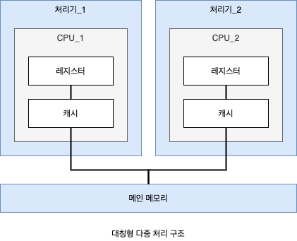

이 모델의 장점은 많은 프로세스를 동시에 실행할 수 있다는 것입니다. N개의 CPU가 있으면 성능을 크게 저하하지 않으면서 N개의 프로세스를 실행할 수 있습니다. 그러나 CPU가 독립적이기 때문에 하나는 유휴 상태이고 다른 하나는 과부하가 걸려 비효율적일 수 있습니다.

**다중 처리기**의 정의는 시간이 지남에 따라 발전해 왔으며 이제는 여러 개의 컴퓨팅 코어가 단일 칩에 상주하는 **다중 코어** 시스템을 포함합니다. 칩 내 통신이 칩 간 통신보다 빠르므로 다중 코어 시스템은 단일 코어를 가지는 여러 칩보다 효율적일 수 있습니다. 또한 여러 개의 코어를 가지는 하나의 칩은 여러 개의 단일 코어 칩보다 훨씬 적은 전력을 사용하는데, 이는 노트북뿐만 아니라 모바일 장치에서 중요한 문제입니다. 이 설계에서 각 코어에는 자체 레지스터 세트와 레벨 1 (L1) 캐시하고도 하는 자체 로컬 캐시가 있습니다. 또한 레벨 2 (L2) 캐시는 칩에 국한되지만 두 처리 코어에서 공유합니다. 로컬 하위 레벨 캐시는 일반적으로 상위 레벨 공유 캐시보다 작고 빠릅니다.


다중 처리기 시스템에 CPU를 추가하면 컴퓨팅 성능이 향상됩니다. 그러나 앞에서 제안한 것처럼 이러한 개념은 그다지 확장성이 좋지 않고, CPU를 너무 많이 추가하면 시스템 버스에 대한 경합에 병목 현상이 되어 성능이 저하되기 시작합니다. 다른 방법은 각 CPU(또는 CPU 그룹)에 작고 빠른 로컬 버스를 통해 엑세스 되는 자체 로컬 메모리를 제공하는 것입니다. CPU마다 하나의 로컬 메모리를 가지며, 모든 CPU가 **공유 시스템 연결**로 연결됩니다. **NUMA**(Non-uniform Memory Access)라고 하는 이 방법의 장점은 CPU가 로컬 메모리에 액세스 할 때 빠를 뿐만 아니라 시스템 상호 연결에 대한 경합도 없다는 것입니다. 따라서 NUMA 시스템은 더 많은 프로세서가 추가될수록 더 효과적으로 확장할 수 있습니다. NUMA의 시스템의 잠재적 단점은 CPU가 시스템 상호 연결을 통해 원격 메모리(다른 CPU의 로컬 메모리)에 액세스해야 할 때 지연 시간이 증가하여 성능 저하가 발생할 수 있다는 것입입니다.

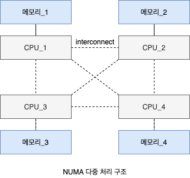

마지막으로 **블레이드 서버**는 다수의 처리기 보드 및 입출력 보드, 네트워킹 보드들이 하나의 **섀시**(chassis) 안에 장착되는 형태를 가집니다. 블레이드 서버와 전통적인 다중 처리기 시스템과의 차이점은 각 블레이드-처리기 보드는 독립적으로 부팅될 수 있고, 자기 자신의 운영체제를 수행한다는 것입니다. 어떤 블레이드-서버 보드는 자체가 다중 처리기이기도 하며, 이런 형태는 컴퓨터 유형 간의 유형 경계를 모호하게 만듭니다. 근본적으로 이 블레이드 서버는 여러 독립적인 다중 처리기 시스템으로 구성됩니다.

### 1.3.3 클러스터형 시스템

**클러스터 시스템**은 여러 CPU를 가진 시스템의 또 다른 유형입니다. 둘 이상의 독자적 시스템 또는 노드들을 연결하여 구성한다는 점에서 다중 처리기 시스템과 차이가 납니다. 각 노드는 통상 다중 코어 시스템이며, **약결합**(Loosely Coupled)로 간주됩니다. 이들은 저장장치를 공유하고 근거리 통신망(Local Area Network, LAN)이나 InfiniBand와 같은 고속의 상호 연결망으로 연결됩니다.

클러스터링은 통상 **높은 가용성**을 제공하기 위해 사용됩니다. 즉, 클러스터 내 하나 이상의 컴퓨터 시스템이 고장 나더라도 서비스는 계속 제공됩니다. 남아 있는 하드웨어 수준에 비례하여 서비스를 계속 제공하는 기능을 **우하한 성능 저하**(Greateful degaradation)라고 합니다.

- **비대칭형 클러스터:** 다른 컴퓨터들이 응용 프로그램을 실행하는 동안 한 컴퓨터는 **긴급 대기 모드** 상태를 유지합니다. 이 모드의 호스트는 활성 서버들을 감시하는 작업만을 수행합니다. 서버가 고장 난다면 긴급 대기 모드의 호스트가 활성 서버가 됩니다.
- **대칭형 클러스터:** 둘 이상의 호스트들이 응용 프로그램을 실횅하고 서로를 감시합니다. 대칭형 구성이 효율적으로 동작하기 위해서는 하나 이상의 응용 프로그램이 실행 가능해야 합니다.

애플리케이션이 클러스터의 **고성능 계산 환경**을 이용할 수 있도록 작성되어야 합니다. 이는 **병렬화**라는 기법으로 프로그램을 컴퓨터의 개별 코어에서 혹은 클러스터의 각 컴퓨터에서 수행되는 분리된 요소로 나누는 작업을 포함합니다. 이들 애플리케이션은 클러스터의 각 계산 노드가 문제 일부를 해결한 후 모든 노드의 결과를 결합하여 최종 해답을 얻게 됩니다.

클러스터의 발전은 **스토리지 전용 네트워크**(Storage-Area Network, SAN)에 의해 가능해졌습니다. SAN은 여러 호스트를 여러 저장장치에 부착할 수 있게 합니다. 만일 에플리케이션과 데이터가 SAN에 저장된다면 클러스터 소프트웨어는 SAN에 연결된 임의의 호스트에서 수행되도록 애플리케이션을 배정할 수 있습니다.

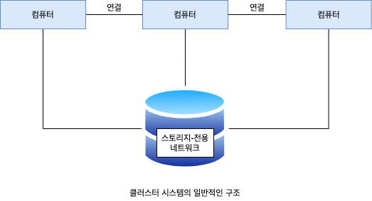

## 1.4 운영체제의 작동

컴퓨터의 전원을 켜거나 재부팅 할 때와 같이 컴퓨터를 실행하려면 초기 프로그램을 실행해야 합니다. 일반적으로 부트스트랩 프로그램은 컴퓨터 하드웨어 내에 펌웨어로 저장되며, CPU 레지스터에서 시스템의 모든 측면을 초기화합니다. 부트스트앱 프로그램은 운영체제를 적재하는 방법과 해당 시스템 실행을 시작하는 방법을 알아야 하는데, 그러려면 운영체제 커널을 찾아 메모리에 적재해야 합니다.

커널이 적재되어 실행되면 시스템과 사용자에게 서비스를 제공할 수 있습니다. 부팅할 때 메모리에 적재되는 시스템 프로그램에 의해 시스템 데몬이 실행됩니다. Linux에서 첫 번째 시스템 프로그램은 **systemd**이며 다ㄹㄴ 데몬들을 시작합니다. 이 단계가 완료되면 시스템이 완전히 부팅되고 시스템은 어떤 이벤트가 발생할 때까지 기다립니다.

**트랩**은 I/O 장치에 의한 하드웨어 인터럽트와 다른 형태의 인터럽트로, 오류 또는 사용자 프로그램의 특정 요청 때문에 발생하는 소프트웨어 인터럽트입니다. 이 특정 요청은 **시스템 콜**이라는 특수 연산을 실행하여 요청되고 운영체제가 제공하는 서비스가 수행될 것을 요구합니다.

### 1.4.1 다중 프로그래밍과 다중 테스킹

운영체제의 가장 중요한 측면 중 하나는 일반적으로 하나의 프로그램은 CPU나 I/O 장치 모두를 항상 바쁘게 유지할 수 없으므로, 여러 프로그램을 실행할 수 있다는 것입니다. **다중 프로그래밍**은 CPU가 항상 한 개의 프로그램을 실행할 수 있도록 구성하여 CPU 이용률을 높이고 사용자 만족도를 높입니다. 다중 프로그램 시스템에서 실행 중인 프로그램을 **프로세스**라고 합니다. 운영체제는 여러 프로세스를 동시에 메모리에 유지하면서, 프로세스 중 하나를 선택하여 실행합니다. 해당 프로세스가 대기해야 하는 경우 운영체제는 CPU가 다른 프로세스를 실행할 수 있도록 전환합니다.

**다중 테스킹**(Multitasking)은 다중 프로그래밍의 논리적 확장입니다. 다중 테스킹 시스템에서 CPU는 여러 프로세스를 전환하며 실행하지만, 전환이 자주 발생하여 사용자에게 **빠른 응답 시간**을 제공합니다. 일반적으로 프로세스가 완료되거나 I/O를 수행하기 전에 짧은 시간 동안만 실행됩니다. 대화식 입출력은 전형적으로 사람의 속도로 수행되므로 상당히 긴 시간이 걸릴 수 있고, 운영체제는 CPU를 쉬게하지 않고 다른 프로그램으로 신속하게 전환합니다.

동시에 여러 프로세스를 메모리에 유지하려면 **메모리 관리** 방식이 필요합니다. 또한 여러 프로세스가 동시에 실행할 준비가 되면 시스템은 **CPU 스케줄링**을 통해 다음에 실행할 프로세스를 선택해야 합니다. 마지막으로, 여러 프로세스를 병행하게 실행하려면 운영체제의 모든 단계에서 서로 영향을 미치는 기능이 제한되어야합니다. 이 책 전반에 걸쳐 이러한 고려 사항에 대해 논의합니다.

다중 태스킹 시스템에서 운영체제는 적절한 응답 시간을 보장해야 합니다. 일반적인 방법은 **가상 메모리**(Virtual Memory)인데 이것은 일부만 메모리에 적재된 프로세스의 실행을 허용하는 기법입니다. 이 기법의 주요한 이점은 프로그램이 **물리 메모리**의 크기보다 더 커도 된다는 것입니다. 더욱이 가상 메모리는 메인 메모리를 크고 균등한 저장장치의 배열로 추상화하여, 사용자에게 보이는 **논리 메모리**를 물리 메모리로부터 분리시킵니다.

다중 프로그래밍 및 다중 태스킹 시스템도 파일 시스템을 제공해야 합니다. 파일 시스템은 보조저장장치에 존재합니다. 따라서 저장장치 관리가 제공되야 하며, 부적절한 사용으로부터 자원을 보호해야 합니다. 질서 있게 실행하려면 시스템은 프로세스 동기화 및 통신을 위함 기법을 제공해야하며, 프로세스가 서로 영원히 기다리는 교착 상태에 빠지지 않도록 보장해야 합니다.

### 1.4.2 이중-모드와 다중모드 운용

시스템을 올바르게 실행하려면 운영체제 코드 실행과 사용자-정의 코드 실행을 구분할 수 있어야 합니다. 대부분의 컴퓨터 시스템이 취하는 접근 방식은 다양한 실행 모드를 차별화 할 수 있는 하드웨어 지원을 제공하는 것입니다. 적어도 두개의 독릭된 연산 모드, 즉 **사용자 모드**와 **커널 모드**(슈퍼바이저 모드, 시스템 모드, 특권 모드)를 필요로 합니다. **모드 비트**(Mode Bit)라고 하는 하나의 비트가 현재의 모드를 나타내기 위해 컴퓨터 하드웨어에 추가되었습니다. 이 비트는 커널 모드(0) 또는 사용자 모드(1)를 나타냅니다.

시스템 부트 시, 하드웨어는 커널 모드에서 시작합니다. 이어 운영체제가 적재되고, 사용자 모드에서 사용자 프로세스가 시작됩니다. 트랩이나 인터럽트가 발생할 때마다, 하드웨어는 사용자 모드에서 커널 모드로 전환합니다.

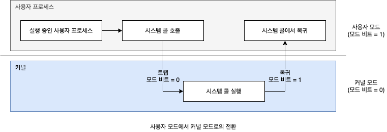

동작의 이중 모드는 잘못된 사용자로부터 운영체제와 사용자를 보호합니다. 우리는 악영향을 끼칠 수 있는 일부 명령을 **특권 명령**(Privileged Instruction)으로 지정하고, 하드웨어는 특권 명령이 커널 모드에서만 수행되도록 허용합니다. 사용자 모드에서 특권 명령을 수행하려고 시도하면, 하드웨어는 이를 실행하지 않고 불법적인 명령으로 간주해 운영체제로 트랩을 겁니다. 모드의 개념은 두 가지 이상으로 확장될 수 있습니다.

**시스템 콜**은 사용자가 프로그램이 자신을 대신하여 운영체제가 수행하도록 저장되어 있는 작업을 운영체제에 요청할 수 잇는 방법을 제공합니다. 시스템 콜이 수행될 때, 시스템 콜은 하드웨어어에 의해 하나의 소프트웨어 인터럽트로 취급됩니다. 제어가 인터럽트 벡터를 통해 운영체제 내의 서비스 루틴으로 전달되고, 모드 비트가 커널 모드로 설정됩니다. 시스템 콜 서비스 루틴은 운영체제의 일부입니다. 커널은 인터럽트를 발생시킨 명령을 검사하여 어떤 시스템 콜이 발생했는지를 결정합니다. 이 때 전달된 인수가 사용자 프로그램이 요청하는 서비스 유형을 표시합니다. 요청이 필요로하는 추가 정보는 레지스터, 스택 또는 메모리로 전달될 수 있습니다. 커널은 인수가 정확하고 합법적인지를 검증하고 요청을 수행한 후 제어를 시스템 콜 다음의 명령으로 복귀시킵니다.

### 1.4.3 타이머

우리는 운영체제가 CPU에 대한 제어를 유지할 수 있도록 보장해야 합니다. 사용자 프로그램이 무한 루프에 빠지거나 시스템 서비스 호출에 실해하여, 제어가 운영체제로 복귀하지 않는 경우가 없도록 방지해야 합니다. **타이머**는 지정된 시간 후 컴퓨터를 인터럽트 하도록 설정할 수 있습니다. **가변 타이머**는 일반적으로 고정률의 **클록**(Fixed-Rate Clock)과 **계수기**로 구현합니다. 운영체제는 계수기 값을 설정합니다. 계수기 값은 클록이 똑딱(Tick)할 때 마다 감소합니다. 계수기가 0이 될 때 인터럽트가 발생합니다.

사용자에게 제어를 양도하기 전에, 운영체제는 타이머가 인터럽트 할 수 있도록 설정되었는지를 확인합니다. 만약 타이머가 인터럽트를 발생하면 제어는 자동으로 운영체제에 넘어가며, 운영체제는 인터럽트를 치명적인 오류로 취급하거나, 프로그램에게 더 많은 시간을 줄 수 있습니다.

## 1.5 자원 관리

운영체제는 **자원 관리자**입니다. 시스템의 CPU, 메모리 공간, 파일 저장 공간 및 I/O 장치는 운영체제가 관리해야 하는 자원에 속합니다.

### 1.5.1 프로세스 관리

프로세스는 자기 일을 수행하기 위해 CPU 시간, 메모리, 파일, 그리고 입출력 장치를 포함한 여러 가지 자원을 필요로 합니다. 이러한 자원은 보통 실행되는 동안 할당됩니다.

프로그램 그 자체는 프로세스가 아닙니다. 하나의 프로그램은 디스크에 저장된 파일의 내용과 같이 **수동적**(Passive) 개체지만, 프로세스는 다음 수행할 명령을 지정하는 **프로그램 카운터**(Promgram Counter)를 가진 **능동적**(Active)인 개체입니다. CPU는 프로세스가 끄날 때 까지 그 프로세스의 명령들을 차례대로 수행합니다. 따라서 두 개의 프로세스가 동일한 프로그램과 연관되어 있더라도, 그들은 구 개의 별도의 수행 순서로 간주됩니다. 다중 스레드 프로세스는 여러 개의 프로그램 카운터를 가지고 있으며, 이 카운터들은 각 스레드가 실행할 다음 명령어를 가리키게 됩니다.

운영체제는 프로세스 관리와 연관해 다음과 같은 활동에 대한 책임을 집니다.

- 사용자 프로세스와 시스템 프로세스의 생성과 제거
- CPU에 프로세스와 스레드 스케줄하기
- 프로세스의 일시 중지와 재수행
- 프로세스 동기화를 위한 기법 제공
- 프로세스 통신을 위한 기법 제공

### 1.5.2 메모리 관리

메모리는 크기가 수십 만에서 수십 억까지의 범위를 갖는 바이트 대용량 배열입니다. 각 바이트는 자신의 주소를 가집니다. 메인 메모리는 CPU와 입출력 장치에 의하여 공유되는, 빠른 접근이 가능한 데이터 저장소입니다. 폰 노이만 방식의 컴퓨터에서는 CPU가 **명령어 인출 사이클**(Instruction Fetch-Cycle) 동안 메인 메모리로부터 명령어를 일고, **자료 인출 사이클**(Data Fetch-Cyvcle) 동안 메모리로부터 데이터를 일고 씁니다. 메인 메모리는 일반적으로 CPU가 직접 주소를 지정하고 접근할 수 있는 유일한 대량 메모리입니다.

프로그램이 수행되기 위해서는 반드시 절대 주소로 **매핑**(Mapping)되고 메모리에 적재되어야 합니다. 프로그램을 수행하면서, 이러한 절대 주소를 생성하여 메모리의 프로그램 명령어와 데이터에 접근합니다. 프로그램이 종료되고, 프로그램이 차단되면 차지하던 메모리 공간은 가용공간으로 선언되고, 다음 프로그램이 적재되어 수행될 수 있습니다.

CPU 이용률과 사용자에 대한 컴퓨터의 응답 속도를 개선하기 위해, 우리는 메모리에 여러 개의 프로그램을 유지해야 하며 이를 위해서 메모리 관리 기법이 필요합니다. 이런 기법은 메모리 관리에 대한 여러 접근 방법을 반영하는데, 각 알고리즘의 효율성은 특정 상황에 따라 다릅니다. 특히 하드웨어 설계에 좌우되며, 각 알고리즘은 자기를 위한 하드웨어 지원이 필요합니다.

운영체제는 메모리 관리와 관령하여 다음과 같은 일을 담당합니다.

- 메모리의 어느 부분이 현재 사용되고 있으며, 어느 프로세스에 의해 사용되고 있는지를 추적해야 합니다.
- 필요에 다라 메모리 공간을 할당하고 회수해야 합니다.
- 어떤 프로세스들을 메모리에 적재하고 제거할 것인가를 결정해야 합니다.

### 1.5.3 파일 시스템 관리

컴퓨터는 여러 유형의 물리적 매체에 정보를 저장할 수 있습니다.2차 저장장치가 가장 일반적이지만 3차 저장장치도 가능합니다. 이러한 각 매체는 자신의 특성과 물리적 구성을 가지고 있습니다. 대부분의 매체는 디스크 드라이브와 같은 장치에 의해 제어되며, 이들 장치 또한 자신의 독특한 특성이 있습니다.

파일은 파일 생성자에 의해 정의된 관련 정보의 집합체입니다. 일반적으로 파일은 프로그램(소스와 목적 프로그램 형태)과 데이터를 나타냅니다. 운영체제는 대량 저장 매체와 그것을 제어하는 장치를 관리함으로써 파일의 추상적인 개념을 구현합니다. 또한, 파일을 사용하기 쉽도록 통상 디렉터리들로 구성하고, 접근을 통제합니다.

운영체제는 파일 관리를 위하여 다음과 같은 일을 담당합니다.

- 파일의 생성 및 제거
- 디렉터리 생성 및 제거
- 파일과 디렉터리를 조작하기 위한 프리미티비의 제공
- 파일을 보조저장장치로 매핑
- 안정적인(비휘발성) 저장 매체에 파일을 백업

### 1.5.4 대용량 저장장치 관리

컴퓨터 시스템은 메인 메모리를 백업하기 위해 보조저장장치를 제공해야 합니다. 대부분의 최신 컴퓨터 시스템은 HDD와 NVM 장치를 프로그램과 데이터 모두에 대한 주요 온라인 저장 매체로 사용합니다. 운영체제는 보조저장장치 관리와 관련하여 다음 활동을 담당합니다.

- 마운팅과 언마운팅
- 사용 가능 공간(Free-Space)의 관리
- 저장장소 할당
- 디스크 스케줄링
- 저장장치 분할
- 보호

동시에 보조저장장치보다 더 느리고 비용은 적게 들고 때로는 용량이 더 큰 장치를 필요로 하는 경우도 많습니다. 3차 저장장치는 시스템 성능에 중요하지 않지만 운영체제에 의해 관리되어야만 합니다. 어떤 운영체제들은 이 역할을 직접 수행하며, 다른 운영체제들은 이 역할을 응용 프로그램에게 맡기기도 합니다.

### 1.5.5 캐시 관리

정보는 통상 어떤 저장장치(메인 메모리와 같은)에 보관됩니다. 정보가 사용됨에 따라, 더 빠른 장치인 캐시에 일시적으로 복사됩니다. 그리고 우리가 특정 정보를 필요로 할 경우, 먼저 캐시에 그 정보가 있는지를 조사합니다. 만약 캐시가 있으면 우리는 그 정보를 가져와서 사용하지만, 만일 캐시에 없다면 메인 메모리 시스템으로부터 그 정보를 가져와서 사용해야 하며, 이 댸 이 정보가 다음에 곧 다시 사용될 확률이 높다는 가정하게 캐시에 넣습니다.

디스크와 메모리 간의 데이터 전송은 통상 운영체제에 의해 제어됩니다. 메모리 계층 구조에서, 동일한 데이터가 서로 다른 수준의 저장장치 시스템에 나타나게됩니다. B라는 파일에 있는 A라는 변수가 1 증가되어야 한다고 생각해 봅니다.

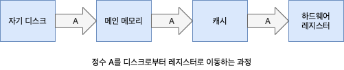

1. 증가 연산은 A가 있는 디스크 블록을 메인 메모리로 복사해오는 입출력 연산을 호출합니다.
2. A를 캐시에 복사하고, 이어 A를 내부 래지스터로 복사합니다.
3. A 내부 레지스터에서 증가가 일어나면, A의 값은 여러 저장장치 시스템에서 서로 달라집니다.
4. A의 값은 자기 디스크에 새로운 A의 값이 다시 기록된 이후에야 비로소 같아집니다.

CPU가 여러 개의 프로세스 사이에서 이리저리 전환되는 다중 태스킹 환경에서는, 여러 개의 프로세스가 A에 접근하기를 원할 경우 이들 각 프로세스가 가장 최근에 갱신된 A의 값을 얻을 것을 보장하기 위해 극도의 주의가 필요합니다. 다중 처리기 환경하에서는 상황이 더욱 복잡해집니다. 여러 개의 CPU가 모두 동시에 실행될 수 있으므로, 한 캐시에 있는 A 값이 갱신될 경우 A가 존재하는 모든 캐시에 즉각적으로 반영되어야 합니다. 이러한 상황을 **캐시 일관성 문제**라고 하며, 이는 일반적으로 하드웨어적 문제입니다. 분산 환경에서는 동일한 파일의 여러 사본을 다른 컴퓨터에 보관할 수 있어 더욱 복잡합니다. 시스템은 더영한 방법을 통해 복제본을 한 곳에서 업데이트 할 때 다른 모든 복제본을 가능한 빨리 최신 상태로 유지하는 것을 보장합니다.

### 1.5.6 입출력 관리 시스템

운영체제의 목적 중의 하나는 사용자에게 특정 하드웨어 장치의 특성을 숨기는 것입니다. 단지 장치 드라이버만이 특정 장치의 특성을 알고 있습니다. 효율적인 입출력 서브시스템을 구성하기 위하여 인터럽트 핸들러와 장치 드라이버가 사용됩니다.

## 1.6 보안과 보호

만일 컴퓨터 시스템이 다수의 사용자를 가지며 다수 프로세스의 병행 수행을 허용한다면, 데이터에 대한 접근은 반드시 규제되어야 합니다. 이를 위해 파일, 메모리 세그먼트, CPU 및 다른 자원들에 대해 원영체제로부터 적절한 허가를 획득한 프로세스만이 작업을 할 수 있도록 보장하는 기법이 필요합니다. **보호**란 컴퓨터 시스템이 정의한 자원에 대해 프로그램, 프로세스, 또는 사용자들의 접근을 제어하는 기법입니다. 이 기법은 시행될 제어에 대한 명세와 이들을 강제 시행하는 방법을 규정하는 수단을 반드시 제공해야 합니다. 보호는 구성요소 서브시스템 간의 인터페이스에서 잠재적인 오류를 검출함으로써 시스템의 신뢰성을 증가시킬 수 있습니다. 보호되지 않은 자원은 권한이 없거나 또는 무자격 사용자에 의해 사용(또는 오용)될 수 있습니다.

컴퓨터 시스템은 충분한 보호 기능이 있더라도 여전히 고장이 나거나 부적절한 접근을 허용할 수 있습니다. 이러한 외부 또는 내부의 공격을 방어하는 것이 바로 **보안**입니다. 어떤 운영체제는 이 공격들의 일부를 막는 기능을 고려하고 있으며 다른 운영체제들은 이를 정책이나 부가적인 애플리케이션에 맡기고 있습니다.

보호와 보안을 제공하기 위해서는 시스템의 모든 사용자를 구분할 수 있어야 합니다. 운영체제의 대부분은 사용자 이름과 연관된 **사용자 식별자**(User IDs)의 리스트를 유지합니다. Windows 용어로는 **보안 식별자**(Security ID, SID)라고 합니다. 이 식별자는 사용자마다 할당되고, 시스템에서 유일한 값을 가집니다. 사용자가 로근인 할 때 인증 단계에서 사용자에게 맞는 적절한 식별자를 결정합니다. 이 사용자 식별자는 사용자의 모든 프로세스나 스레드에 연관됩니다. 식별자를 사용자가 읽어야 할 필요가 있을 때 사용자 이름 리스트를 통하여 원래의 사용자 이름으로 변환합니다. 어던 상황에서는 각 사용자가 아니라 사용자의 집합을 구분하기를 원합니다. 그룹 기능은 시스템 전체에 존재하는 그룹 이름과 **그룹 식별자**의 리스트로 구현될 수 있습니다. 사용자는 운영체제를 설계했을 때의 결정에 다라 하나 이상의 그룹에 속할 수 있습니다. 사용자의 그룹 식별자 역시 관련된 모든 프로세스나 스레드에 연관됩니다.

시스템을 정상적으로 사용하는 동안 사용자 식별자와 그룹 식별자만 있으면 충분합니다. 그러나 사용자는 때때로 원하는 작업을 수행하기 위해서 **권한을 상승**해야 할 때가 있습니다. 운영체제는 권한 상승을 허용하는 다양한 방법을 제공합니다.

## 1.7 가상화

**가상화**는 단일 컴퓨터(CPU, 메모리, 디스크 드라이브, 네트워크 인터페이스 카드 등)의 하드웨어를 여러 가지 실행 환경으로 추상화하여 개별 환경이 자신만의 컴퓨터에서 실행되고 있다는 환상을 만들 수 있는 기술입니다. 이러한 환경은 동시에 실행되고 서로 상호 작용할 수 있는 다른 개별 운영체제로 볼 수 있습니다. **가상 머신**의 사용자는 단일 운영체제에서 동시에 실행되는 다양한 프로세스 간에 전환할 수있는 것과 동일한 방식으로 다양한 운영체제 간에 전환할 수 있습니다.

소프트웨어로 컴퓨터 하드웨어 시뮬레이션 하는 **애물레이션**은 일반적으로 소수 CPU 유형이 대상 CPU 유형과 다른 경우에 사용되며, 한 기계를 위해 작성된 전체 운영체제를 다른 기계에서 수행되도록 확장될 수 있습니다. 그렇지만 애뮬레이션은 비용이 큽니다. 만일 소스와 목표 CPU가 비슷한 성능 수준일 경우 애퓰레이트된 코드는 원래의 코드보다 훨씬 느리게 수행됩니다.

이와 달리 가상화에서는 특정 CPU를 위해 컴파일된 운영체제가 동일 CPU용의 다른 운영체제 내에서 수행됩니다. **가상 머신 관리자**(VMM)은 **게스트**(Guest)라 불리는 하나 이상의 운영체제를 수행하고 그들의 자원 이용을 관리하며 각 게스트를 서로로부터 보호합니다. 현대의 운영체제가 다수의 애플리케이션을 신뢰성 있게 수행할 능력이 있다고 해도, 가상화의 이용은 지속해서 성장하고 있습니다. 랩톱과 데스크톱에서 VMM은 체험을 위하거나 또는 다른 호스트용으로 작성된 운영체제상의 애플리케이션을 수행하기 위해 다수의 운영체제를 설치할 수 있게 합니다.

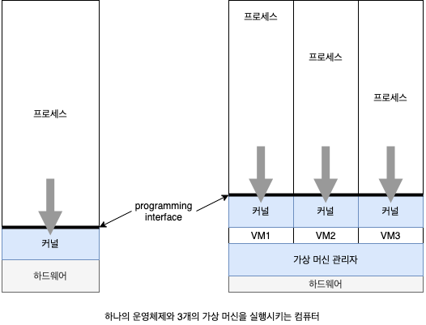

## 1.8 분산 시스템

**분산 시스템**은 물리적으로 떨어져 있는 이기종 컴퓨터들의 집합입니다. 분산 시스템의 컴퓨터들은 사용자가 시스템 내의 다양한 자원들을 접근할 수 있도록 네트워크로 연결되어 있습니다. 공유 자원에 대한 접근은 계산 속도와 기능, 데이터 가용성 및 신뢰성을 향상시킵니다. 몇몇 운영체제는 네트워킹의 자세한 사항을 네트워크 인터페이스의 장치 드러이버에 포함시킴으로써 네트워크에 대한 접근을 파일 접근 형태로 일반화시킵니다. 다른 운영체제들은 사용자가 특정 네트워크 기능을 명시적으로 호출하게 합니다. 일반적으로 시스템상에는 두 모드가 혼재되어 있으며 그 예로 FTP와 NFS를 들 수 있습니다. 분산 시스템을 만드는 프로토콜은 시스템의 유용성과 대중성에 큰 영향을 줄 수 있습니다.

**네트워크**는 가장 단순하게 보면 두 개 이상 시스템 간의 통신 경로입니다. 분산 시스템의 많은 기능은 네트워킹에 의존하고 있습니다. 네트워크는 사용되는 프로토콜, 노드 간의 거리, 그리고 전성 매체에 따라 다릅니다. 비록 ATM과 여타 프로토콜들이 널리 사용되고 있지만 **TCP/IP**가 가장 일반적인 네트워크 프로토콜로 인터넷의 기본 구조를 제공합니다. 모든 범용 운영체제를 포한하여 운영체제 대부분은 TCP/IP를 지원합니다. 운영체제의 입장에서 네트워크 프로토콜은 인터페이스 장치(네트워크 어뎁터 등), 이를 관리하는 장치 드라이버 및 데이터를 처리하는 소프트웨어가 있어야 합니다.

네트워크는 노드 간의 거리에 의해 유형이 결정됩니다. **근거리 통신만**(LAN)은 한 방, 한 층, 또는 한 건물에 존재합니다. **광역 통신망**(WAN)은 통산 건물, 도시 또는 국가 사이를 연결합니다. 이드 ㄹ네트워크는 하나 또는 다수의 프로토콜을 사용할 수 있습니다. 새로운 기술의 개발에 따라 새로운 형태의 네트워크가 생겨나고 있습니다. 예를 들면, **도시권 통신망**(MAN)은 한 도시 내의 건물들을 연결할 수 있습니다. 블루투스(BlooTooth)와 802.11 장치는 무선 통신 기술을 사용하여 수 미터 짧은 거리에서 통신하며 실질적으로 전화기와 헤드셋 사이 또는 스마트폰과 데스크톱 컴퓨터 사이에 **딴거리 통신만**(Personal-Area Netawork, PAN)을 만듭니다.

일부 운영체제는 네트워크 연결 제공 개념을 넘어서서 네트워크 및 분산 시스템 개념을 취했습니다. **네트워크 운영체제**는 다른 컴퓨터의 다른 프로세스가 메시지를 교환할 수 있도록 하는 통신 체계와 함께 네트워크를 통한 파일 공유과 같은 기능을 제공하는 운영체제입니다. 네트워크 운영체제를 실행하는 컴퓨터는 네트워크를 인식하고 다른 네트워크 컴퓨터와 통신할 수 있지만, 네트워크의 다른 모든 컴퓨터와는 자율적으로 작동합니다. 분산 운영체제는 그에 비해 덜 자율적인 환경을 제공합니다. 하나의 운영체제가 네트워크를 제어하는 것처럼 보이기 위해 여러 컴퓨터가 밀접하게 통신합니다.

## 1.9 커널 자료구조

### 1.9.1 리스트, 스택 및 큐

배열의 각 항은 직접 접근할 수 있으나 리스트의 항들은 특정 순서로 접근해야 합니다. 즉, **리스트**는 데이터 값들의 집단을 하나의 시퀀스로 표시합니다. 이 구조를 구현하는 가장 일반적인 방법이 **연결 리스트**(Linked List)입니다.

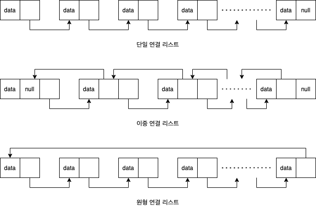

- **단일 연결 리스트:** 각 항은 후속항을 가리킵니다.
- **이중 연결 리스트:** 각 항은 자신의 앞 항과 뒷 항을 가리킵니다.
- **원형 연결 리스트:** 리스트의 마지막 항이 널(null)이 아니라 첫 항을 가리킵니다.

연결 리스트는 가변 수의 항들을 수용하며 항의 삭제와 삽입이 쉽습니다. 리스트를 사용할 경우 가능한 단점은 길이가 n인 리스트에서 특정 항을 인출할 때의 성능이 선형, 즉 O(n)이라는 점입니다. 리스트는 커널 알고리즘에 의해 직접 사용되며, 스택이나 큐 같은 보다 강력한 자료구조를 구축하는데 사용됩니다.

**스택**은 순차적 순서를 가진 자료구조로 항을 넣거나 꺼내는 데 **후입선출**(Last In First Out, LIFO)을 사용합니다. 즉, 스택에 마지막에 삽입된 항이 먼저 인출됩니다. 스택에 항을 삽입하거나 인출하는 일은 각각 **푸쉬**(Push) 또는 **팝**(Pop)이라 부릅니다. 반면, **큐**는 순차 순서의 자료구조로 **선입선출**(First In First Out, FIFO)을 사용합니다. 각 항은 삽입된 순서대로 큐로부터 제거됩니다.

### 트리

트리는 데이터 서열을 표시하는 데 사용 가능한 자료구조입니다. 트리 구조에서 데이터 값들은 부모-자식 관계로 연결됩니다. **일반 트리**(Gerneral Tree)에서 부모는 임의의 수의 자식을 가질 수 있습니다. **이진 트리**에서 부모는 최대 두 개의 자식을 가질 수 있으며, 이들은 **좌측 자식**, **우측 자식**이라 부릅니다. **이진 탐색 트리**는 추가로 부모의 두 자식 사이에 `좌측 자식 <= 우측 자식` 순서를 요구합니다. 이진 탐색 트리에서 한 항을 찾으려면 최악의 경우 성능이 O(n)입니다. 이러한 상황을 방지하기 위해 우리는 **균형 이진 탐색 트리**를 만드는 알고리즘을 사용할 수 있습니다. 그 경우 n개의 항을 갖는 트리는 최대 깊이가 log n이며, 따라서 최악의 경우 성능 O(log n)을 보장합니다.

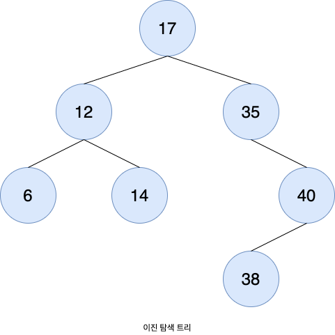

### 1.9.3 해시 함수와 맵

**해시 함수**는 데이터를 입력으로 받아 이 데이터에 산술 연산을 수행하여 하나의 수를 반환합니다. 이 수는 그 데이터를 인출하기 위해 테이블(전형적으로 하나의 배열)의 인덱스로 사용할 수 있습니다. 크기 n인 리스트에서 데이터를 찾는 데 최대 O(n)의 비교가 필요한 반면에 테이블에서 해시 함수를 사용하여 데이터를 인출할 경우 O(1)만큼 좋을 수도 있으며 이는 상세 구현에 좌우됩니다.

해시 함수의 한 어려운 점은 두 개의 서로 다른 입력이 하나의 출력 값을 가질 수 있는 것입니다. 즉 이들이 테이블의 동일 위치로 색인 될 수 있습니다. 이를 우리는 **해시 충돌**(Hash Collision)이라 하며 테이블의 각 항에 연결 리스트를 두어 동일한 해시 값을 갖는 모든 항을 수록하게 합니다. 물론 충돌이 많을수록 해시 함수의 효율이 떨어지게 됩니다.

해시 함수의 한 용도는 **해시 맵**을 구현하는 일입니다. 해시 맵은 해시 함수를 사용하여 \[키:값]을 연관(또는 맵)시킵니다. 일단 매핑이 성립되면 키에 해시 함수를 적용해여 해시 맵으로부터 그 값을 얻을 수 있습니다.

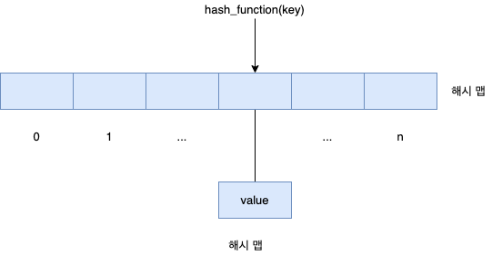

### 1.9.4 비트맵

**비트맵**은 n개의 항의 상태를 나타내는 데 사용 가능한 n개의 이진 비트의 스트링입니다. 비트맵에서 i번째 위치의 값은 i번째 자원과 연관되어 있습니다. 비트맵의 힘은 이들의 공간 효울을 생각하면 자명합니다. 만일 단일 비트대신 8비트의 부울 값을 사용한다면 자료구조는 8배의 크기가 될 것입니다. 따라서 비트맵은 대량의 자원의 가용성을 표시할 때 일반적으로 사용됩니다.

```
001011101
```

## 1.10 계산 환경

### 1.10.1 전통적 계산

오늘날의 웹 기술은 전통적인 계산의 경계를 확장하고 있습니다. 한때는 큰 비용이 들었던 네트워크 연결 속도는 싼 비용으로 이용 가능하며, 더 많은 데이터에 더 많은 접근이 가능합니다. 오늘날 전통적 시분할 시스템은 희귀한 시스템이 되었습니다. 동일한 스케쭐링 기법이 워크스테이션과 서버세서 사용되고 있습니다. 그러나 모든 프로세스는 한 사용자가 전부 소유하거나 또는 단일 사용자와 운영체제가 소유하고 있는 형태를 취합니다.

### 1.10.2 모바일 컴퓨팅

**모바일 컴퓨팅**은 휴대용 스마트폰 태블릿 컴퓨터의 컴퓨팅 환경을 말합니다. 데스크톱이나 랩톱과 비교하면 휴대용 시스템은 화면 크기, 메모리 용량과 전체적 기능을 포기한 대신 이메일과 웹브라우징 같은 서비스에 대해 손에 쥘 수 있는 휴대용 접근을 얻은 것입니다. 그렇지만 지난 몇 년 동안 휴대용 장치의 기능이 풍부해져서 랩톱과 태플릿 컴퓨터 사이의 기능 구분이 분명하지 않게 되었습니다.실제 최신 휴대용 장치는 데스크톱이나 랩톱 컴퓨터에 없거나 실용성이 떨어졌던 기능조차 가능합니다.

온라인 서비스에 접근을 허용하기 위해 휴대장치는 전형적으로 IEEE 표준 802.11 숸 또는 휴대 전화 데이터망을 사용합니다. 그렇지만 휴대장치의 메모리 용량과 처리속도는 PC보다는 제한적입니다. 비슷하게 전력 소모가 대단한 관심사이기 때문에 휴대장치는 종종 전통적 데스크톱이나 랩톱 컴퓨터의 처리기보다 작고 느리며, 더 적은 수의 처리기 코어를 갖습니다.

### 1.10.3 클라우드 서버 컴퓨팅

현대 네트워크 구조는 **서버 시스템**이 **클라이언트 시스템**이 생성한 요청을 만족시키는 배치를 특징으로 합니다.

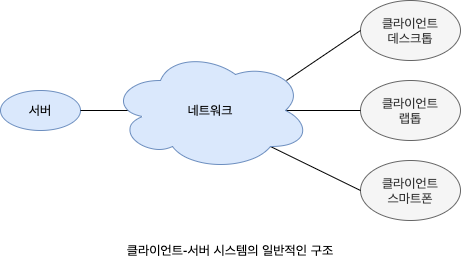

- **게산-서버 시스템:** 클라이언트가 어떤 작업을 요청할 수 있는 인터페이스를 제공합니다. 서버는 작업을 수행하고 결과를 클라이언트에게 돌려보냅니다.
- **파일-서버 시스템:** 클라이언트가 파일을 생성, 갱신, 읽기 및 제거할 수 있는 파일 시스템 인터페이스를 제공합니다.

### 1.10.4 피어 간 계산

분산 시스템의 다른 구조는 **피어 간 시스템**(Peer-To-Peer, P2P)입니다. 이 모델에서는 클라이언트 서버가 서로 구별되지 않습니다. 대신 시스템상의 모든 노드가 피어로 간주되고 각 피어는 서비스를 요청하느냐 제공하느냐 에 따라 클라이언트 및 서버로 동작합니다. 피어 간 시스템은 전통적인 클라이언트 서버에 비해 장점을 제공합니다. 클라이언트 서버 시스템에서는 서버가 병목으로 작용합니다. 그러나 피어 간 시스템에서는 서비스가 네트워크에 반산된 여러 노드에 의해 제공될 수 있습니다.

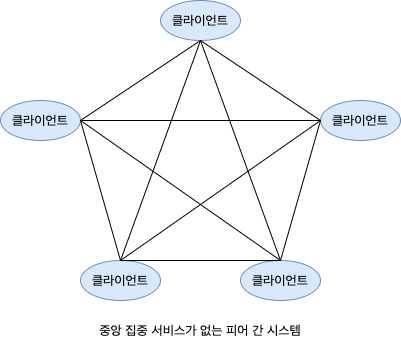

- 노드가 네트워크에 참여할 때 네트워크의 중앙 검색 서비스에 자신이 제공하는 서비스를 등록합니다. 특정 서비스를 원하는 노드는 먼저 이 중앙 검색 서비스를 통하여 어떤 노드가 서비스를 제공하는지 확인해야 합니다. 나머지 통신은 클라이언트와 서비스 제공자 사이에서만 발생합니다.
- 위의 대안 기법은 중앙 검색 서비스를 사용하지 않습니다. 클라이언트로 동작하는 피어는 원하는 서비스를 제공하는 노드를 찾아내기 위하여 네트워크상의 모든 노드에게 서비스 요청 메시지를 방송합니다. 그 서비스를 제공하는 노드 또는 노드들은 피어에게 응답 메시지를 보냅니다. 이 방법을 지원하기 위해서는 피어들이 다른 피어들이 제공하는 서비스를 발견하기 위한 **발견 프로토콜**이 제공되어야 합니다.

### 1.10.5 클라우드 컴퓨팅

**클라우드 컴퓨팅**은 계산, 저장장치는 물론 애플리케이션조차도 네트워크를 통한 서비스로 제공하는 계산 융형입니다. 어떤 면에서 클라우드 컴퓨팅은 가상화를 그 기능의 기반으로 사용하기 때문에 가상화의 논리적 확장입니다.

- **공중 클라우드:** 서비스를 위해 지불 가능한 사람은 누구나 인터넷을 통새 사용 가능한 클라우드
- **사유 클라우드:** 한 회사가 사용하기 위해 운영하는 클라우드
- **혼합형 클라우드:** 공공과 사유 부분을 모두 포함하는 클라우드

- **소프트웨어 서비스**(Software as a Service, SaaS): 인터넷을 통해 사용 가능한 하나 이상의 애플리케이션(워드 프로세서나 스프레드시트 같은)
- **플랫폼 서비스**(Platform as a Service, PasS): 인터넷을 통해 사용하도록 애플리케이션에 맞게 준비된 소프트웨어 스택(예를 들면 데이터베이스 서버)
- **하부구조 서비스**(Interface as a Service, IasS): 인터넷을 통해 사용 가능한 서버나 저장장치(예를 들면 생산 데이터의 백업 복사본을 만들기 위한 저장장치)

클라우드 컴퓨팅 환경은 다수 유형의 조합을 제공하기 때문에 이들 클라우드 컴퓨팅의 유형들은 서로 독립적이 아닙니다. 예를 들면 한 조직이 공중 서비스로 SasS와 IaaS를 모두 제공할 수 있습니다.

물론 많은 유형의 클라우드 하부구조 내에 전통적인 운영체제가 존재합니다. 그 위에는 사용자 프로세스가 수행되는 가상기계를 관리하는 VMM이 있습니다. 더 위로는 클라우드 관리 도구가 있어 VMM을 관리합니다. 이들 도구들은 주어진 클라우드의 자원을 관리하며, 클라우드 구성요소들에 대한 인터페이스를 제공하므로 이들을 새로운 유형의 운영체제로 볼 수 있는 근거를 제공합니다.

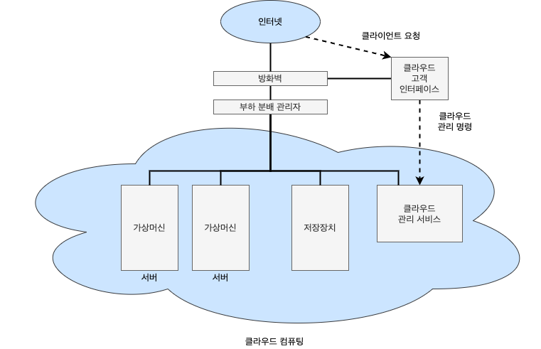

### 1.10.6 실시간 내장형 시스템

내장형 시스템 장치들은 아주 특정한 작업만을 수행하는 경향이 있습니다. 일반적으로 사용자 인터페이스가 거의 없으며, 자동차 엔진이나 로봇 팔과 같은 하드웨어 장치들을 감시하고 관리하는 데 시간을 보냅니다. 내장형 시스템들은 매우 다양합니다. 어던 시스템은 UNIX와 같은 범용 운영체제를 수행시키면서 특수 목적을 가진 응용 프로그램을 수행시키는 형태를 갖습니다. 다르 ㄴ시스템은 필요한 기능만을 제공하는 내장형 운영체제를 가지고 있는 하드웨어 형태를 취합니다. 또 다른 시스템은 운영체제 없이 필요한 작업을 수행하는 응용 전용 칩(Application-Sepcific Intefrated Circuits, ASICs)만을 갖는 하드웨어 장치들입니다.

내장형 시스템은 거의 언제나 **실시간 운영체제**를 수행합니다. 실시간 시스템은 처리기의 작동이나 데이터의 흐름에 엄격한 시간 제약이 있을 때 사되며, 시간 제약 내에 올바른 결과를 돌려줄 수 있을 때에만 정확히 동작하는 것으로 간주됩니다. 따라서 실시간 시스템은 종종 전용 애플리케이션에서 제어 장치로 사용됩니다.

## 1.11 무료 및 공개 운영체제

**무료 운영체제**와 **공개 소스 운영체제**는 컴파일된 이진 코드가 아닌 소스 코드 형식으로 제공됩니다. 소스 코드로부터 프로그래머는 한 시스템에서 실행 가능한 이진 코드를 생성할 수 있습니다. **역공학**(Reverse Engineering)을 통하여 이진 코드로부터 소스 코드를 얻어내는 반대의 작업은 매우 많은 노력이 필요하며 주석과 같은 유용한 사항들을 복원해 낼 수는 없습니다. 무료 소프트웨어는 소스 코드를 공개할 뿐만 아니라 무료 사용, 재배포 및 수정을 허용하도록 라이선스를 받게 됩니다. 공개 소스 소프트웨어는 반드시 그러한 라이선스로 제공하지는 않습니다. 따라서 모든 무료 소프트웨어는 공개 소스이지만 일부 공개 소스 소프트웨어는 **무료**가 아닙니다. GNU/Lunux는 가장 유명한 공개 소스 운영체제이며, 일부 배포판은 무료이고 다른 배포판은 단지 공개 소스일 뿐입니다. 공개 소스 운영체제는 많은 장점이 있습니다. 그 예로 관심 있는 프로그래머들의 공동체를 들 수 있으며, 이 프로그래머들으 ㄴ코드를 작성하고, 디버깅에 도움을 주고, 코드를 분석하고, 자원을 제공하고, 수정 사항을 제안함으로써 코드 발전에 기여합니다. 이론의 여지는 있지만, 더 많은 프로그래머들이 코드를 검토하기 때문에 공개 소스 코드가 비고액 소스 코드와 비교하면 보안성이 더 높습니다.

## 1.11.1 역사

현대 컴퓨팅 초기에 소프트웨어는 일반적으로 소스 코드와 함께 제공되었습니다. 하지만 컴퓨터 및 소프트웨어 회사는 결국 소프트웨어 사용을 승인된 컴퓨터 및 유료 고객으로 제한하려고 하였습니다. 소스 코드 자체가 아닌 소스 코드에서 컴파일된 이진 파일만 릴리스하면 이 목표를 달성하고 코드와 아이디어를 경쟁 업체로부터 보호할 수 있었습니다. 1980년까지는 독점 소프트웨어가 일반적인 경우였습니다.

## 1.11.2 무료 운영체제

소프트 웨어 사용 및 재배포를 제한하려는 움직임에 대응하기 위해 1984년 Richard Stallman은 GNU라는 무료 UNIX 호환 운영체제를 개발하기 시작했습니다. Stallman에게 **무료**는 가격이 아니라 사용의 자유를 의미합니다. 자유 소프트웨어 운동은 소프트웨어의 금전적 거래를 반대하는 것이 아니라 사용자가 다음과 같은 네 가지 자유가 보장되어야 한다고 주장했습니다.

1. 자우롭게 소프트웨어를 실행 시킬 권리
2. 소스 코드를 분석하고 수정할 권리
3. 코드 수정 없이 배포하거나 판매할 권리 또는
4. 코드를 수정하여 배포하거나 판매할 권리

Stallman이 설립한 **자유 소프트웨어 재단**(FSF)는 **copyleft** 라이선스 형식을 자신들의 프로그램에 사용합니다. 저작물을 카피레프트 한다는 것은 재배포 시 4가지 자유가 그대로 유지되기만 하면 저작물을 소유한 사람에게 저작물을 자유롭게 만드는 4가지 필수 자유가 부여됩니다. **GNU General Public License**(GPL)는 자유 소프트웨어가 공개되는 일반 라이선스입니다. 기본적으로 GPL에서는 소스 코드를 바이너리와 함께 배포하고 모든 사본을 동일한 GPL 라이선스로 배포해야 합니다.

### 1.11.3 GNU/Linux

1991년 핀란드의 Linus Torvalds 학생은 GNU 컴파일러와 도구를 사용하여 초보적은 UNIX 유사 커널을 출시했으면, 전 세계에 공동 개발을 요청하였습니다. 인터넷의 출현으로 관심 있는 사람은 누구나 소스 코드를 다운로드하여 수정하고, Torabalds에게 변경 사항을 제출할 수 있었습니다. 일주일에 한 번 업데이트를 릴르스하면서 Linux 운영체제는 수천 명의 프 로그래머에 의해 빠르게 성장할 수 있었습니다. 1991년 Linux는 라이선스가 비상업적 재배포만 허용했기 때문에 무료 소프트웨어가 아니었습니다. 그러나 1992년에 Torvalds는 GPL에 따라 Linux를 다시 릴리스하여 무료 소프트웨어로 만들었습니다.

그 결과로 GNU/Linux 운영체제(커널만 말할 때는 Linux라고 하지만 GNU 도구를 포함한 전체 운영체제는 GNU/Linux라고 부름)는 시스템의 수백 가지의 고유한 **배포판** 또는 사용자 맞춤 빌드를 생성했습니다. 주요 배포판에는 Red Hat, SUSE, Fedora, Debian, Slackware 및 Ubuntu가 있습니다. 배포판은 기능, 유틸리티, 설치된 응용 프로그램, 하드웨어 저원, 사용자 인터페이스 및 목적에 따라 다릅니다.

아래의 간단하고 무료인 방법을 통해 다른 시스템에서 Linux를 수행할 수 있습니다.

1. 무료인 Virtualbox VMM 도구를 아래에서 다운로드 받아 시스템에 설치합니다. [https://www.virtualbox.org/](https://www.virtualbox.org/)
2. CD와 같은 설치 이미지를 기반으로 운영체제를 처음부터 새로 설치하거나 다음과 같은 사이트에서 더 빠르게 설치하고 실행할 수 있는 미리 설치된 운영체제 이미지를 선택합니다. 이러한 이미지는 운영체제와 응용 프로그램이 함꼐 사전 설치되어 있고 다양한 GNU/Linux 배포판이 제공됩니다. [http://virtualbox.org/images/](http://virtualbox.org/images/)
3. Virtualbox 내에서 가상 머신을 부팅합니다.

### 1.11.4 BSD Unix

BSD UNIX는 Linux보다 오래되고 복잡한 역사를 가지고 있습니다. Linux와 마찬가지로 FreeBSD, NetBSD, OpenBSD 및 DragonflyBSD 등의 여러 배포판이 존재합니다. FreeBSD의 소스 코드를 탐구하고 싶으면, 단지 위에서 설명한 Linux의 경우와 같이 원하는 버전의 가상 머신 이미지를 다운로드 받아 Virtualbox에서 부팅시키면 됩니다. 소스 코드는 배포판에 포함되어 있으면, 위치는 `/usr/src/`에 저장됩니다. 커널 소스 코드는 `/usr/src/sys`에 존재합니다.

많은 공개 소스 프로젝트와 마찬가지로 이 소스 코드는 **버전 제어 시스템**에 포함되어 제어됩니다. 버전 제어 시스템을 사용하면 사용자는 전체 소스 코드 트리를 자신의 컴퓨터에 **풀**(Pull)하고 수정 사항을 저장소로 다시 **푸시**(Push)하여 다른 사용자가 풀 할 수 있게 합니다. 이러한 시스템은 각 파일의 수정 기록과 하나의 파일이 동시에 수정되는 경우 충돌 해결 기능을 포함한 다른 기능도 제공합니다. 다른 버전 제어 시스템으로는 GUN/Linux 및 기타 프로그램에 사용되는 **git**이 있습니다.

### 1.11.5 Solaris

**Solaris**는 Sun Mycorsystems사의 Unix 기반 사용 운영체제입니다. Solaris 코드의 대부분을 OpenSolaris 프로젝트로 공개 소스화 하였지만, Oracle사가 Sun을 사들임에 따라 이 프로젝트의 상태가 불확실하게 되었습니다.

## 1.12 요약

- 운영체제는 컴퓨터 하드웨어를 관리하고 응용 프로그램 실행 환경을 제공하는 소프트웨어입니다.
- 인터럽트는 하드웨어가 운영체제와 상호 작용하는 주요 방법입니다. 하드웨어 장치는 CPU에 신호를 보내 인터럽트를 촉발하여 일브 이벤트에 주의가 필요하다는 것을 CPU에 경고합니다. 인터럽트는 인터럽트 헨들러에 의해 관리됩니다.
- 컴퓨터가 프로그램을 실행하려면 프로그램이 메인 메모리에 있어야 합니다. 이 메모리는 프로세서가 직접 액세스 할 수 있는 유일한 대용량 저장장치입니다.
- 메인 메모리는 일반적으로 전원을 끄거나 잃을 때 내용이 손실되는 휘발성 저장장치입니다.
- 비휘발성 저장장치는 메인 메모리의 확장이며, 대량의 데이터를 연구적으로 보유할 수 있습니다.
- 가장 일반적인 비휘발성 저장장치는 프로그램과 데이터를 모두 저장할 수 있는 하드디스크입니다.
- 컴퓨터 시스템의 다양한 저장장치 시스템은 속도와 비용에 따라 계층 구조로 구성할 수 있습니다. 레벨이 높을수록 비싸지만 속도가 빠릅니다. 계층이 내려갈수록 일반적으로 비트당 비용은 감소하고 반면 엑세스 시간은 증가합니다.
- 최신 컴퓨터 아키텍처는 각 CPU에 여러 컴퓨팅 코어가 포함된 다중 처리기 시스템입니다.
- CPU를 최대한 활용하기 위해 최신 운영체제는 다중 프로그래밍을 사용하여 여러 작업을 동시에 메모리에 적재할 수 있으므로, 항상 CPU가 실행할 작업이 있게 보장합니다.
- 다중 테스킹은 CPU 스케줄링 알고리즘이 프로세스 간에 빠르게 전환하여 사용자에게 빠른 응답 시간을 제공하는 다중 프로그래밍의 확장입니다.
- 사용자 프로그램이 시스템의 올바른 작동을 방해하지 않도록 시스템 하드웨어는 사용자 모드와 커널 모드의 두 가지 모드가 있습니다.
- 다양한 명령어가 특권을 가지며 커널 모드에서만 실행될 수 있습니다. 예를 들어 커널 모드로 전환하는 명령, I/O 제어, 타이머 관리 및 인터럽트 관리가 이러한 명령어들입니다.
- 프로세스는 운영체제의 기본 작업 단위입니다. 프로세스 관리에는 프로세스 생성 및 삭제와 프로세스 간 통신 및 동기화 기법 제공이 포함됩니다.
- 운영체제는 사용 중인 메모리 영역과 사용 중인 프로세스를 추적하여 메모리를 관리합니다. 또한 메모리 공간을 동적으로 할당하고 해제해야 합니다.
- 저장장치 공간은 운영체제에서 관리합니다. 이러한 책무에는 파일 및 디렉터리를 나타내는 파일 시스템을 제공하고 대용량 저장장치의 공간을 관리하는 것이 포함됩니다.
- 운영체제는 운영체제 및 사용자를 보호하고 안전하게 만들기 위한 기법을 제공합니다. 보호 조치는 컴퓨터 시스템에서 사용 가능한 자원에 대한 프로세스 또는 사용자의 액세스를 제업합니다.
- 가상화에는 컴퓨터 하드웨어를 여러 가지 실행 환경으로 추상화하는 작업이 포함됩니다.
- 운영체제에서 사용되는 자료구조에는 리스트, 스택, 큐, 트리 및 맵이 포함됩니다.
- 컴퓨팅은 전통적인 컴퓨팅, 모바일 컴퓨팅, 클라이언트-서버 시스템, 피어 간 시스템, 클라우드 컴퓨팅 및 실시간 임베디드 시스템을 포함하여 다양한 환경에서 이루어집니다.
- 무료 및 공개 소스 운영체제는 소스 코드 형식으로 제공됩니다. 무료 소프트웨어는 무료로 사용, 재배포 및 수정이 가능합니다. GNU/Linux, FreeBSD 및 Solaris는 널리 사용되는 공개 소스 시스템의 예입니다.
